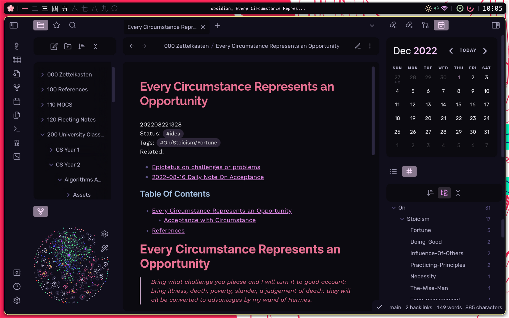

# Obsidian Apatheia

Use the [Style Settings Plugin](https://github.com/mgmeyers/obsidian-style-settings) to change the color scheme, fonts, border radius, and such.

# ⭐ Credits
- [Zenneh](https://github.com/zenneh) for his contributions to the theme, and his [Style Settings Compiler](https://github.com/zenneh/Obsidian-SCSS-Style-Settings)
- This theme is inspired by the [Things Theme](https://github.com/colineckert/obsidian-things)
- Uses Fonts that were also used in the fonts [Ultra Lobster Theme](https://github.com/7368697661/Ultra-Lobster)
